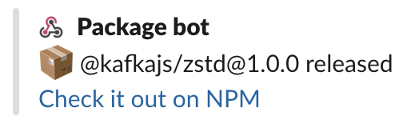

# Demo NPM package release Slack notification

This is a sample application developed for an article written for Confluent's blog. It is not intended to be production-ready, but rather to serve as a basic example of how to use KafkaJS.

This application sets up a server that receives NPM webhook events on package publishing and publishes those messages to Kafka. A consumer then consumes those messages and posts them to a Slack channel.



## Getting started

This application requires a reasonably recent version of Node.js (tested on v14). In order to run a local Kafka cluster, Docker is also required.

```sh
# Install dependencies
$ npm install

# Start docker containers
$ docker-compose up -d

# Run server and consumer
$ npm start

# If you prefer to run the server and consumer separately
$ npm run start:server
$ npm run start:consumer
```

## Configuration

Configuration is done by setting environment variables:

* `HOOK_SECRET` - Secret used when registering the hook with NPM **REQUIRED**
* `SLACK_WEBHOOK_URL` - [Slack incoming webhook URL](https://api.slack.com/messaging/webhooks) to post messages to **REQUIRED**
* `TOPIC` - The topic to produce to and consume from (default: `npm-package-published`)
* `PORT` - Port for the HTTP server to listen on (default: `3000`)
* `BOOTSTRAP_BROKER` - Initial broker to connect to (default: `localhost:9092`)
* `KAFKA_SSL` - [TLS SecureContext](https://nodejs.org/api/tls.html#tls_tls_connect_options_callback) options. Can be set to `true` to use TLS with default configuration, else a JSON object that gets passed to `JSON.parse`. `false` will connect without encryption (default: `false`)
* `KAFKA_USERNAME` & `KAFKA_PASSWORD` - SASL credentials. Will connect without authentication if left empty (default: `undefined`)

### Creating a topic

When using the provided `docker-compose.yml` file, the topic will be created automatically when producing the first message. If not using topic auto-creation, the script in `bin/create-topic` can be used to create the topic ahead of time:

```sh
# Create the topic 'npm-package-published' with 3 partitions
$ ./bin/create-topic "npm-package-published" 3
```

## Sending a test message

To see that the application is working, start the server and consumer and then send a test message:

```sh
$ ./bin/send-event
send-event <url> <secret> ./path/to/payload.json

$ ./bin/send-event http://localhost:3000/hook "very-secret-string" ./fixtures/payload.json
"OK"
```

## Registering hook with NPM

`npm` has the ability to add hooks directly in the CLI. In this example, I'm using [ngrok](https://ngrok.com/) to establish a tunnel to expose my IP on the public internet.

```sh
# Setting up the tunnel to forward from my ngrok.io address to port 3000 on my localhost
$ ngrok http 3000

Session Status                online
Account                       <email> (Plan: Free)
Version                       2.3.35
Region                        Europe (eu)
Web Interface                 http://127.0.0.1:4040
Forwarding                    http://4d6d3b9e3ed3.eu.ngrok.io -> http://localhost:3000
Forwarding                    https://4d6d3b9e3ed3.eu.ngrok.io -> http://localhost:3000

Connections                   ttl     opn     rt1     rt5     p50     p90
                              0       0       0.00    0.00    0.00    0.00

# Registering webhook with NPM
# Note that you need to login first with `npm adduser`
$ npm hook add kafkajs https://4d6d3b9e3ed3.eu.ngrok.io "super-secret-string"
+ kafkajs  ➜  https://4d6d3b9e3ed3.eu.ngrok.io

# Check your existing hooks
$ npm hook ls
You have one hook configured.
┌──────────┬─────────┬──────────────────────────────────┐
│ id       │ target  │ endpoint                         │
├──────────┼─────────┼──────────────────────────────────┤
│ 1hog35p1 │ kafkajs │ https://4d6d3b9e3ed3.eu.ngrok.io │
│          ├─────────┴──────────────────────────────────┤
│          │ never triggered                            │
└──────────┴────────────────────────────────────────────┘

# Delete the hook once you don't need it anymore
$ npm hook rm 1hog35p1
- kafkajs  ✘  https://4d6d3b9e3ed3.eu.ngrok.io
```